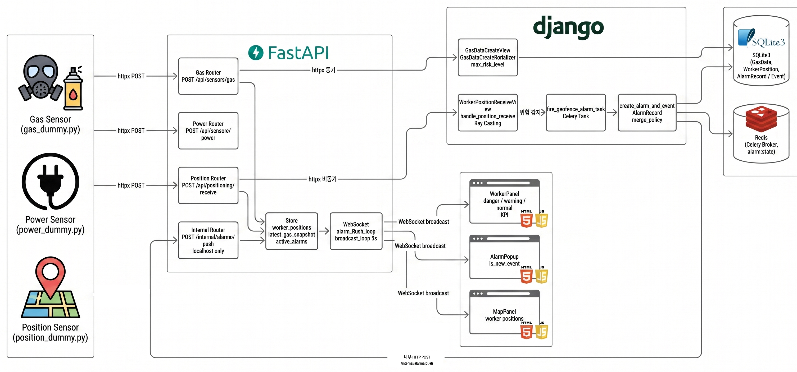

# diconai — 산재 예방 통합 관제 시스템

> IoT 가스·전력·위치 센서로 현장을 실시간 감지하고 자동 알람으로 **사고 발생 전 개입**을 목표하는 산업재해 예방 통합 관제 플랫폼.


---

## 📖 프로젝트 소개

### 왜 만들었는가

2026년 고용노동부 집계 기준, 제조업 현장에서 화재·폭발로 인한 산재 사망자는 전년 동기 10명에서 **20명으로 두 배** 늘었습니다. 지게차 충돌과 정비·점검 중 끼임 사고는 전년과 동일한 수준으로 반복되고 있고, 유해가스 누출 같은 산업 사고도 줄어들지 않고 있습니다. *(출처: [연합뉴스 2026.04.13](https://www.yna.co.kr/view/AKR20260413132900530))*

공통점은 하나입니다 — **감지가 늦었거나, 감지했어도 대응이 늦었습니다.**

**diconai project**는 IoT 가스·전력·위치 센서 데이터를 가정하여  현장을 실시간 모니터링하고 위험 상황을 자동 판정해 관리자·작업자에게 즉시 알람을 전달함으로써 **사고 발생 전 개입**을 목표로 하는 산업재해 예방 통합 플랫폼입니다. **유해가스 / 지오펜스(가상 위험구역) / 전력 이상** 세 가지 감지 축으로 현장 위험을 종합적으로 커버합니다.

### 기술 구조

IoT 수신·브라우저 송출은 현재 **5초 주기**로 운영하고 있으며, 초기 구현 단계에서 **수신 데이터 량과 DB 처리 속도로 인한 메시지 적체·드롭**을 고려해 안정성 확보 차원에서 5초로 잡은 값입니다(다음 단계 목표는 **3초**). 동기 ORM 호출이 이벤트 루프를 막는 문제를 해결하기 위해 **DRF**(영속성·인증·비즈니스 로직)와 **FastAPI**(IoT 수신·실시간 스트림) 두 서버로 책임을 분리하고, **Celery + Redis** 비동기 파이프라인으로 알람 처리를 묶었습니다.

데이터 흐름은 단방향입니다 — `IoT → FastAPI → DRF (저장)`. **일반 센서 통합 데이터는 5초 주기로 브라우저에 브로드캐스트**되며, **알람은 `Celery → Redis → FastAPI 내부 엔드포인트 → WebSocket → 브라우저` 순으로 이벤트 기반 즉시 전달**됩니다.

---

## 🛠 기술 스택

| Layer | Stack |
|---|---|
| **Backend (DRF)** | Python 3.12, Django 6.0.4, DRF 3.17, JWT (simplejwt), drf-spectacular |
| **Realtime (FastAPI)** | FastAPI 0.135, Uvicorn (uvloop), Pydantic 2.13 |
| **Async / Queue** | Celery 5.4, Redis 5.2 |
| **Database** | PostgreSQL 14+ (운영 예정) / SQLite (개발 기본) |
| **Tooling** | uv, pre-commit (ruff + ruff-format) |

상세 의존성: [drf-server/requirements.txt](drf-server/requirements.txt), [fastapi-server/requirements.txt](fastapi-server/requirements.txt)

---

## 📐 아키텍처



> 센서는 FastAPI로만 들어오고 영속성은 DRF가 책임진다. 센서 통합 데이터는 5초 주기로 브라우저에 송신되고, 알람은 `Celery → Redis → FastAPI 내부 엔드포인트 → WebSocket` 순으로 이벤트 즉시 전달된다.

**핵심 컴포넌트**

| 컴포넌트 | 역할 |
|---|---|
| **FastAPI :8001** | IoT 센서 수신·검증, WebSocket 브로드캐스트 |
| **DRF :8000** | 인증(JWT), DB 영속성, REST API, HTML 렌더링 |
| **Celery 워커** | 알람 비동기 처리, DB 저장 |
| **Redis** | Celery 브로커 + 캐시 |
| **PostgreSQL** | 영속 저장소 (개발 시 SQLite 가능) |

---

## ✨ 주요 기능

- **다종 가스 모니터링** — CO·H2S·CO2·O2·NO2·SO2·O3·NH3·VOC 9종을 1초 주기로 수신, 임계치별 위험도(NORMAL/CAUTION/DANGER) 자동 산정
- **전력 과부하 감지** — 16채널 동시 감시, 채널당 W 기준으로 2단계 알람
- **위험구역(Geofence)** — Ray casting 기반 다각형 내포 판정, 작업자 진입 시 즉시 푸시
- **작업자 실시간 위치** — 1초 주기 WebSocket 스트림, `measured_at` vs `received_at` 분리로 통신 지연 측정
- **알람 영속화 + 즉시 전파** — Celery로 DB 저장과 브로드캐스트 분리, `AlarmRecord`는 *불변* 모델로 감사 추적 보장
- **JWT 인증 + 4단계 권한** — SUPER_ADMIN / FACILITY_ADMIN / WORKER / VIEWER
- **자동 OpenAPI 문서** — drf-spectacular Swagger UI + FastAPI `/docs`

---

## 🚀 실행 방법

### Prerequisites

- Python 3.12
- [uv](https://docs.astral.sh/uv/) (패키지 매니저)
- Redis 6+ (Celery 브로커)
- PostgreSQL 14+ *(선택 — 미설정 시 SQLite 사용)*

### 1. Clone & 루트 설치

```bash
git clone https://github.com/checkCJY/diconai.git
cd diconai
uv venv && source .venv/bin/activate
uv pip install -r requirements.txt
pre-commit install
```

### 2. DRF 서버 (:8000)

```bash
cd drf-server
uv venv && source .venv/bin/activate
uv pip install -r requirements.txt
cp .env.example .env          # 환경변수 작성 (아래 ⚙️ 섹션 참고)
python manage.py migrate
python manage.py runserver
```

### 3. FastAPI 서버 (:8001)

```bash
cd fastapi-server
uv venv && source .venv/bin/activate
uv pip install -r requirements.txt
cp .env.example .env          # 환경변수 작성 (아래 ⚙️ 섹션 참고)
uvicorn app:app --reload --port 8001
```

### 4. Celery 워커 *(알람 비동기 처리용 — 필수)*

알람 영속화·이벤트 변환·실시간 push가 모두 Celery 태스크로 처리되므로 워커가 떠 있지 않으면 알람 흐름이 동작하지 않습니다. Celery는 Redis를 브로커로 사용하므로 **Redis가 설치되어 있고 서버가 실행 중**이어야 합니다.

```bash
# 1) Redis 설치 (한 번만)
sudo apt install redis-server   # Ubuntu / WSL
# brew install redis            # macOS

# 2) Redis 서버 실행 (별도 터미널)
redis-server                    # 또는 sudo service redis-server start

# 3) Celery 워커 실행
cd drf-server
celery -A config worker -l info
```

### 5. 마스터 데이터 시드 *(더미·센서 연동 시 필수)*

DRF는 수신된 `device_id`로 `GasSensor` / `PowerDevice` 마스터를 조회하므로, **마스터가 등록되지 않은 device_id의 데이터는 404로 거부됩니다.** 위치 더미도 `worker_id=1~4`에 해당하는 `CustomUser`가 사전에 존재해야 합니다.

아래 명령이 더미 송출에 필요한 마스터 데이터를 한 번에 생성합니다 (재실행 안전).

> ⚠️ **`createsuperuser`는 반드시 시드 이후에 실행하세요.** 시드가 worker `id=1~4`를 먼저 점유해야 슈퍼유저가 `id=5` 이상으로 부여되어 위치 더미와 충돌하지 않습니다.

```bash
cd drf-server
python manage.py seed_dummy_data        # Facility, Worker × 4, GasSensor, PowerDevice 생성
python manage.py createsuperuser        # 슈퍼유저 (id=5+ 자동 부여)
```

생성 항목:

| 항목 | 값 |
|---|---|
| `Facility(id=1)` | 도면 1290×590 |
| `CustomUser × 4` | `id=1~4` (`worker_a~d`, user_type=WORKER, 비밀번호 `worker1234!`) |
| `GasSensor` | `device_id="63200c3afd12"` |
| `PowerDevice` | `device_id="63200c3afd12"`, 16채널 |

> 부서/직급 13종은 마이그레이션이 자동으로 채워줍니다 ([accounts/migrations/0005_seed_department_position.py](drf-server/apps/accounts/migrations/0005_seed_department_position.py)). 시드 명령 본체는 [apps/core/management/commands/seed_dummy_data.py](drf-server/apps/core/management/commands/seed_dummy_data.py).

### 6. 더미 데이터 송출 *(개발·시연용 — 선택)*

```bash
cd fastapi-server   # FastAPI 가상환경 활성화 상태에서
python -m dummies.gas_dummy        # 가스 9종 (DEVICE_ID="63200c3afd12")
python -m dummies.power_dummy      # 전력 16채널 (DEVICE_ID="63200c3afd12")
python -m dummies.position_dummy   # 작업자 4명 위치 (worker_id=1~4)
```

각각 별도 터미널에서 실행. 송출 주기·위험 발생 확률 등은 `fastapi-server/.env`의 `DUMMY_*` 변수로 조절합니다.

### 접속

| 페이지 | URL |
|---|---|
| 대시보드 | http://localhost:8000/dashboard/ |
| 어드민 | http://localhost:8000/admin-panel/ |
| DRF Swagger UI | http://localhost:8000/api/schema/swagger-ui/ |
| FastAPI Docs | http://localhost:8001/docs |

> 전체 명령어 모음은 [docs/conventions/COMMANDS.md](docs/conventions/COMMANDS.md) 참고.

---

## 🐳 Docker 통합 환경 (대안)

위 1~6번을 한 번에 띄우는 Docker Compose 환경입니다. 7개 서비스(`drf` + `fastapi` + `redis` + `celery-worker` + `celery-beat` + `prometheus` + `grafana`)가 함께 기동됩니다. **DB는 SQLite를 그대로 사용**하며 `drf-server/db.sqlite3`를 호스트와 공유합니다 (Postgres 전환은 다음 스프린트).

### 사전 요구사항

- Docker Engine 24+ / Docker Compose v2
- WSL2: Docker Desktop의 **Settings → Resources → WSL Integration**에서 현재 배포 토글 ON
- 호스트에 빈 디렉토리 미리 생성 (bind mount 자동 생성 시 root 소유 문제 방지):
  ```bash
  mkdir -p drf-server/media
  ```

### 첫 실행

```bash
# 1) 환경변수 작성
cp .env.docker.example .env.docker
python -c "import secrets; print(secrets.token_urlsafe(50))"   # DJANGO_SECRET_KEY 용
python -c "import secrets; print(secrets.token_urlsafe(32))"   # INTERNAL_SERVICE_TOKEN 용
python -c "import secrets; print(secrets.token_urlsafe(32))"   # JWT_SIGNING_KEY 용
# .env.docker 에 위 값들 채워넣기 (DRF_SERVICE_TOKEN = INTERNAL_SERVICE_TOKEN 동일 값 권장)

# 2) 빌드 + 기동
docker compose build
docker compose up -d

# 3) 상태 확인
docker compose ps
docker compose logs -f drf fastapi
```

기동되면 마이그레이션 + collectstatic이 `drf` 컨테이너 entrypoint에서 자동 실행됩니다 (`celery-worker`/`celery-beat`는 `RUN_MIGRATIONS=0`로 중복 방지).

### 접속

| 서비스 | URL | 비고 |
|---|---|---|
| 대시보드 (DRF) | http://localhost:8000/dashboard/ | |
| FastAPI Docs | http://localhost:8001/docs | |
| WebSocket | `ws://localhost:8001/ws/worker/{user_id}/` | 브라우저 직접 연결 |
| DRF `/metrics` | http://localhost:8000/metrics | django-prometheus |
| FastAPI `/metrics` | http://localhost:8001/metrics | prometheus-fastapi-instrumentator |
| Prometheus | http://localhost:9090 | targets 모두 UP 확인 |
| Grafana | http://localhost:3000 | id `admin` / pw `.env.docker`의 `GRAFANA_PASSWORD` |

### 자주 쓰는 명령

```bash
# Django 명령 (시드, createsuperuser 등)
docker compose exec drf python manage.py seed_dummy_data
docker compose exec drf python manage.py createsuperuser
docker compose exec drf python manage.py showmigrations

# 테스트
docker compose exec drf pytest -q
docker compose exec fastapi pytest -q

# 한 서비스만 재기동 (코드 수정 후)
docker compose build drf && docker compose up -d drf

# 로그 모니터링
docker compose logs -f celery-worker
docker compose logs -f --tail=50 fastapi

# 정리
docker compose down              # 컨테이너만 제거 (볼륨 유지)
docker compose down -v           # 볼륨까지 제거 (Redis/Prometheus/Grafana 데이터 삭제)
```

### 검증 체크리스트

```bash
curl -fsS http://localhost:8000/health/ && echo OK
curl -fsS http://localhost:8001/health/ && echo OK
curl -s http://localhost:8000/metrics | head -5
curl -s http://localhost:8001/metrics | head -5
# Prometheus targets — 모두 state="up"
curl -s http://localhost:9090/api/v1/targets | python -m json.tool | grep -E '"job"|"health"'
```

> SQLite 다중 컨테이너 동시 쓰기는 가벼운 부하에서만 안전합니다. 부하가 늘면 `SQLITE_BUSY` 가능 — 다음 스프린트의 Postgres 전환에서 해소.

---

## ⚙️ 환경 변수

### `drf-server/.env`

| 변수 | 예시 | 비고 |
|---|---|---|
| `DJANGO_SECRET_KEY` | `django-insecure-changeme-...` | **필수** — 운영 시 긴 랜덤 문자열로 교체 |
| `DJANGO_DEBUG` | `True` | 운영 시 `False` |
| `DJANGO_ALLOWED_HOSTS` | `127.0.0.1,localhost` | 쉼표 구분 |
| `DJANGO_LOG_LEVEL` | `INFO` | DEBUG/INFO/WARNING/ERROR |
| `DATABASE_URL` | `postgres://user:pw@host:5432/db` | 미설정 시 SQLite (`db.sqlite3`) 폴백 |
| `REDIS_URL` | `redis://localhost:6379/0` | Celery 브로커 + 캐시 |
| `JWT_ACCESS_TOKEN_LIFETIME_HOURS` | `24` | JWT 액세스 토큰 만료. **Phase 5 옵트인 활성화 시 `1` 권장** |
| `JWT_REFRESH_TOKEN_LIFETIME_DAYS` | `30` | JWT 리프레시 토큰 만료 |
| `JWT_SIGNING_KEY` | (빈 문자열) | **옵트인 (Phase 5)** — 빈 값 = `SECRET_KEY` 폴백. fastapi 와 동일 값 필수 |
| `INTERNAL_SERVICE_TOKEN` | (빈 문자열) | **옵트인 (Phase 5)** — drf ingest + Celery → fastapi 인증 토큰 |
| `ADMIN_BACKOFFICE_URL` | `/admin-panel/accounts-management/` | 어드민 백오피스 진입 URL |
| `FASTAPI_INTERNAL_URL` | `http://127.0.0.1:8001` | Celery → FastAPI 알람 브리지 |
| `FRONTEND_API_BASE_URL` | (빈 문자열) | 빈 값 = same-origin. 운영 시 별도 도메인 지정 |
| `FRONTEND_WS_BASE_URL` | `ws://127.0.0.1:8001` | 브라우저 WebSocket 접속 URL |

### `fastapi-server/.env`

| 변수 | 예시 | 비고 |
|---|---|---|
| `LOG_LEVEL` | `INFO` | DEBUG/INFO/WARNING/ERROR |
| `DRF_BASE_URL` | `http://localhost:8000` | DRF 호출용 |
| `DRF_SERVICE_TOKEN` | (빈 문자열) | fastapi → drf 호출 시 `Authorization: Bearer` 헤더 부착. **옵트인 활성화 시 `INTERNAL_SERVICE_TOKEN` 과 동일 값 필수** |
| `DRF_REQUEST_TIMEOUT_SEC` | `5.0` | DRF 호출 타임아웃 |
| `INTERNAL_SERVICE_TOKEN` | (빈 문자열) | **옵트인 (Phase 5)** — drf 가 보내는 헤더 검증용. drf 와 동일 값 |
| `JWT_SIGNING_KEY` | (빈 문자열) | **옵트인 (Phase 5)** — WS JWT 검증용. drf 와 동일 값 |
| `JWT_ALGORITHM` | `HS256` | JWT 서명 알고리즘. 기본값 그대로 사용 권장 |
| `BROADCAST_INTERVAL_SEC` | `5.0` | 센서 WebSocket 브로드캐스트 주기 |
| `DATA_STALE_THRESHOLD_SEC` | `8.0` | 데이터 미수신 판정 임계 |
| `POWER_THRESHOLD_CAUTION` | `2200` | (Phase 4 이후 deprecated — DB `Threshold` 모델로 이전, fallback 폴백용으로만 유지) |
| `POWER_THRESHOLD_DANGER` | `2860` | (위와 동일) |
| `DUMMY_TARGET_HOST` | `127.0.0.1` | 더미 송출 대상 호스트 |
| `DUMMY_TARGET_PORT` | `8001` | 더미 송출 대상 포트 |
| `DUMMY_SEND_INTERVAL_SEC` | `1.0` | 더미 송출 주기 (초) |
| `DUMMY_RISK_PROBABILITY` | `0.1` | 더미 위험 발생 확률 (0~1) |

> 모든 변수는 [drf-server/.env.example](drf-server/.env.example), [fastapi-server/.env.example](fastapi-server/.env.example)에 동일한 키/기본값으로 정의되어 있습니다 — `cp .env.example .env` 후 필요한 값만 수정하세요.
>
> **이번 브랜치 적용 가이드**: 5분 cheatsheet [docs/refactor/waves/2026_05_09/TEAM_BRIEF.md §2-bis](docs/refactor/waves/2026_05_09/TEAM_BRIEF.md), 머지·운영자용 상세 절차 [docs/refactor/waves/2026_05_09/MIGRATION_GUIDE.md](docs/refactor/waves/2026_05_09/MIGRATION_GUIDE.md). Phase 5 옵트인 활성화 매트릭스는 TEAM_BRIEF §6 참조.

---

## 📡 API 엔드포인트

### DRF (:8000) — 영속성·인증

| Method | Path | 설명 |
|---|---|---|
| POST | `/api/auth/login/` | JWT 로그인 |
| POST | `/api/auth/token/refresh/` | 액세스 토큰 갱신 |
| GET | `/api/alerts/alarms/` | 알람 목록 |
| GET | `/api/alerts/events/` | 이벤트 목록 |
| POST | `/api/monitoring/gas/` | 가스 데이터 저장 *(FastAPI 호출용)* |
| POST | `/api/monitoring/power/data/` | 전력 측정값 저장 |
| GET/POST | `/api/geofences/` | 위험구역 CRUD |
| GET/POST | `/api/gas-sensors/` | 가스 센서 마스터 관리 |
| GET/POST | `/api/power-devices/` | 전력 장비 마스터 관리 |

### FastAPI (:8001) — IoT 수신·실시간

| Method | Path | 설명 |
|---|---|---|
| POST | `/api/sensors/gas` | 가스 9종 측정값 수신 (1초 주기) |
| POST | `/api/power/watt` | 전력 16채널 측정값 |
| POST | `/api/positioning/receive` | 작업자 위치 수신 |
| WS | `/ws/sensors/` | 센서·알람 통합 스트림 |
| WS | `/ws/positions/` | 작업자 위치 스트림 (1초 주기) |
| WS | `/ws/worker/{user_id}/` | 개인 작업자 푸시 |

> 전체 엔드포인트는 [docs/specs/api_specification.md](docs/specs/api_specification.md) 문서, 또는 서버 실행 후 다음 두 곳에서 확인할 수 있습니다.
>
> - **DRF Swagger UI** — http://localhost:8000/api/schema/swagger-ui/
> - **FastAPI Docs** — http://localhost:8001/docs

---

## 🗄 DB 설계


### 핵심 테이블

| 도메인 | 테이블 | 핵심 관계 |
|---|---|---|
| 계정 | `CustomUser` | → `Facility`(소속), → `Position` |
| 시설/장비 | `Facility`, `GasSensor`, `PowerDevice`, `GeoFence` | Facility 1:N 모든 장비/구역 |
| 측정 | `GasData`, `PowerData`, `PowerEvent` | GasSensor 1:N GasData |
| 알람 | `AlarmRecord`, `Event`, `EventLog` | AlarmRecord N:1 Event, Event 1:N EventLog |
| 위치 | `WorkerPosition` | CustomUser 1:N, GeoFence FK (캐시) |

### 설계 포인트

- **`GasData`** — wide 구조: 9종 컬럼(`co`/`h2s`/`co2`/`o2`/`no2`/`so2`/`o3`/`nh3`/`voc`) + `max_risk_level` 캐시 컬럼으로 조회 최적화
- **`AlarmRecord`** — *불변 모델*. `save()` 오버라이드로 update 차단 → 감사 추적 보장
- **`WorkerPosition`** — `measured_at`(센서 측정 시각) vs `received_at`(서버 수신 시각) 분리 → 통신 지연 측정 가능
- **`GeoFence`** — `polygon` JSONField + `contains_point(x, y)` (Ray casting) → 외부 의존성 없이 다각형 내포 판정

> 모델 상세는 [drf-server/apps/](drf-server/apps/) 각 앱 `models/` 참고.

---

## 📁 프로젝트 구조

```
diconai/
├── drf-server/             # Django :8000 — 인증, DB, REST API
│   ├── config/             # settings, urls, celery
│   └── apps/               # accounts, alerts, facilities,
│                           # monitoring, geofence, positioning ...
├── fastapi-server/         # FastAPI :8001 — IoT 수신, WebSocket
│   ├── gas/                # 가스 라우터/스키마/서비스
│   ├── power/              # 전력 라우터/스키마/서비스
│   ├── positioning/        # 위치 라우터/스키마/서비스
│   ├── websocket/          # /ws/* 엔드포인트, 공유 상태
│   └── internal/           # Celery → WS 브리지
└── docs/                   # 컨벤션, API 명세, URL 맵, changelog
```

### Django 앱 레이어 구조

```
apps/<app>/
├── models/        # DB 스키마
├── selectors/     # 읽기 전용 조회
├── services/      # 비즈니스 로직·트랜잭션
├── serializers/   # API 입출력 변환·검증
└── views/         # 요청 → 서비스 호출 → 응답 (로직 금지)
```

> 디렉토리 상세는 [docs/specs/directory-structure.md](docs/specs/directory-structure.md),
> 코딩 컨벤션은 [docs/conventions/dev_convention.md](docs/conventions/dev_convention.md) 참고.

---

## 🐛 트러블슈팅

주요 이슈와 해결 과정은 [docs/changelog/](docs/changelog/)에 페이즈별로 정리되어 있습니다.

- **알람 실시간 전파 지연** — Celery DB 저장 후에야 broadcast → 내부 push 엔드포인트(`/internal/alarms/push/`) + `alarm_flush_loop` 도입으로 즉시 전송 ([7a0f390](https://github.com/checkCJY/diconai/commit/7a0f390))
- **전력 임계치 양쪽 하드코딩** — DRF/JS 동기화 깨짐 → DRF `/api/monitoring/power/thresholds/` 단일 출처 API로 통일 ([34e808c](https://github.com/checkCJY/diconai/commit/34e808c))
- **DRF 레이어 책임 혼재** — view에 비즈니스 로직 섞임, 예외 응답 형식 제각각 → service/selector 분리 + 글로벌 예외 핸들러 도입 ([Phase 4](docs/changelog/phase4_drf_layer_exceptions_swagger.md))
- **프론트 HTTP·WebSocket 호출 분산** — 페이지마다 fetch/ws URL 하드코딩 → 단일 클라이언트 모듈로 통일, 인증 헤더 중앙 처리 ([Phase 3](docs/changelog/phase3_frontend_http_ws_unification.md))

---

## 🚀 향후 개선 포인트

### 브로드캐스트 주기 단축 (5초 → 3초)

현재 `BROADCAST_INTERVAL_SEC = 5.0`으로 운영하고 있습니다. 초기 구현 단계에서 **수신 데이터 량과 DB 처리 속도로 인한 적체**를 고려해 안정성 확보 차원에서 5초로 잡았으며, **다음 단계 목표는 3초 주기**입니다.

| 단계 | 주기 | 상태 |
|---|---|---|
| v1 (현재) | **5초** | 안정 운영 |
| v2 (목표) | **3초** | 개선 예정 |

**개선 방향**

- DRF 저장 경로 비동기화 (Celery 큐 단계 정리, 배치 INSERT 도입)
- WebSocket 페이로드 슬림화 (변경분만 전송 / diff 프로토콜)
- DB 운영 전환 (SQLite → PostgreSQL) 후 인덱스·WAL 튜닝
- FastAPI ↔ DRF 내부 호출의 connection pool 재사용

---

## 📚 관련 문서

- [docs/specs/api_specification.md](docs/specs/api_specification.md) — API 상세 명세
- [docs/specs/url-structure.md](docs/specs/url-structure.md) — 전체 URL 맵
- [docs/conventions/dev_convention.md](docs/conventions/dev_convention.md) — 코딩 컨벤션
- [docs/conventions/github_convention.md](docs/conventions/github_convention.md) — 이슈/PR/커밋 컨벤션
- [docs/changelog/](docs/changelog/) — 페이즈별 변경 이력
- [docs/refactor/waves/2026_05_09/CHANGES_REVIEW.md](docs/refactor/waves/2026_05_09/CHANGES_REVIEW.md) — **이번 브랜치 종합 변경 인벤토리** (5 카테고리 + 리뷰어 체크리스트)
- [docs/refactor/waves/2026_05_09/TEAM_BRIEF.md](docs/refactor/waves/2026_05_09/TEAM_BRIEF.md) — 이번 브랜치 팀 공유용 진입 문서 (5분 cheatsheet 포함)
- [docs/refactor/waves/2026_05_09/MIGRATION_GUIDE.md](docs/refactor/waves/2026_05_09/MIGRATION_GUIDE.md) — 머지·적용 5단계 + 트러블슈팅
