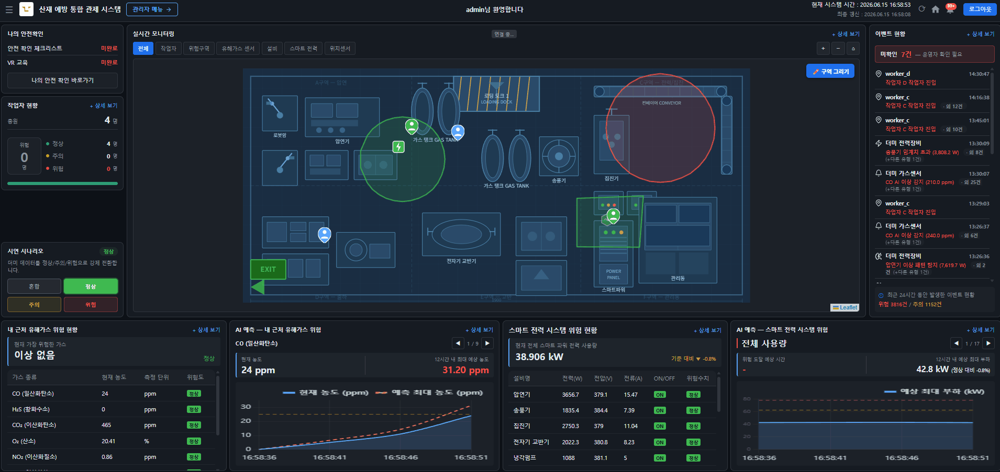
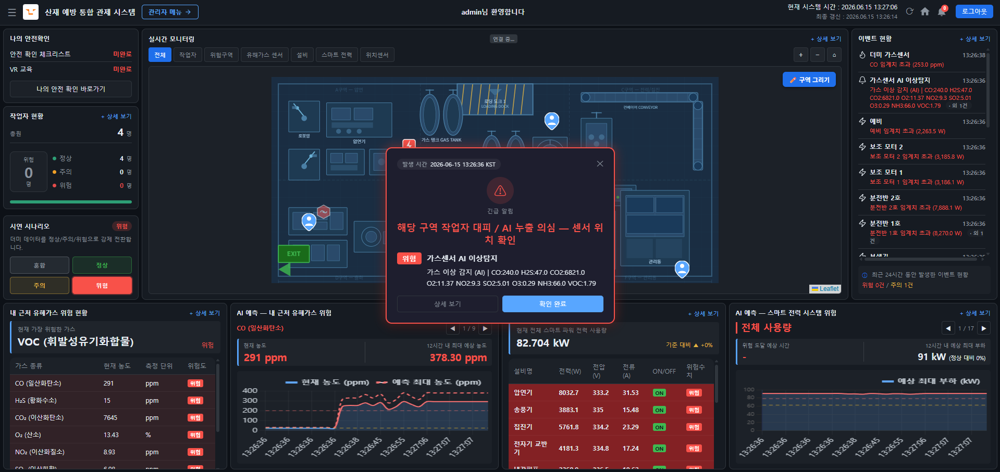
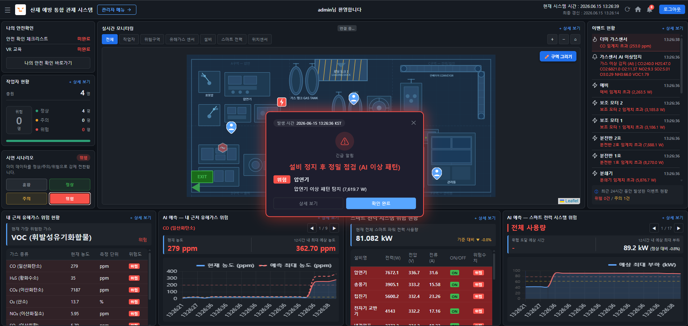
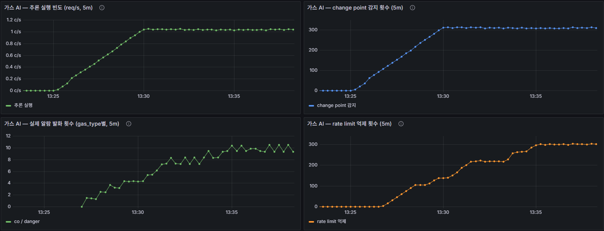
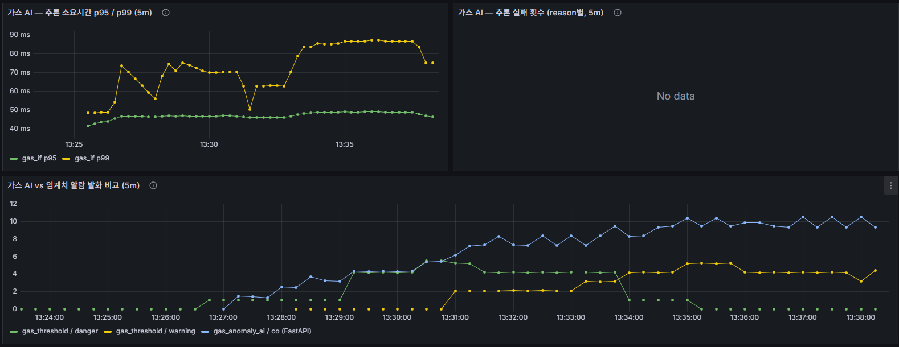
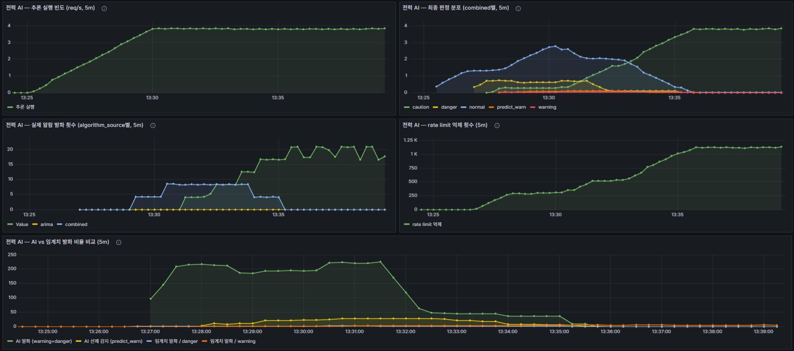

# diconai — 산재 예방 통합 관제 시스템

> IoT 가스·전력·위치 센서로 현장을 실시간 감지하고 자동 알람으로 **사고 발생 전 개입**을 목표하는 산업재해 예방 통합 관제 플랫폼.

> **프로젝트 성격** — 실 IoT 하드웨어 대신 **더미 송출로 센서를 시뮬레이션**하는 PoC(미배포)입니다. 단일 공장(`Facility(id=1)`) 기준이며, 이상탐지는 **룰 기반 임계가 1차 판정 · AI(IF·ARIMA·Change Point)는 보조·실험 단계**입니다. 데모/포트폴리오 목적의 통합 구현에 초점을 맞췄습니다.


---

## 30초 요약

- **무엇** — 유해가스·전력설비·작업자 위치를 실시간 수집·검증하고 AI 이상탐지로 위험 징후를 조기 감지해 운영자·작업자에게 즉시 알람하는 **산재 예방 통합 관제 PoC**.
- **E2E 동작** — 수집 → 검증 → 저장 → 위험 판단 → AI 분석 → 실시간 송출 → 알람까지 더미 기반으로 실제 동작.
- **3대 설계 과제** — ① 임계 도달 전 조기경고(다축 AI: 전력 5축·가스 3축 + 정적 임계 결합) ② 비동기 운영(Celery + Redis 브로커, 알람 Redis Stream(XADD/XREAD), alarm/metric 워커 분리, DRF/FastAPI 역할 분리) ③ 관찰 가능(Prometheus + Grafana 6 대시보드).
- **규모·성과** — 12-서비스 Docker Compose · PostgreSQL 16 · 기능 구현률 **79%**(전체 249개 기능 체크리스트 기준). 가스 부하 병목 진단·해소(p95 **4.2s→0.9s**, 에러 **91%→0%**).
- **성격** — 완성품이 아니라 **동작이 검증된 아키텍처 PoC** — "결승선이 아니라 출발선".

---

## 목차

1. [30초 요약](#30초-요약)
2. [프로젝트 소개](#프로젝트-소개)
3. [기술 스택](#기술-스택)
4. [아키텍처](#아키텍처)
5. [데이터 처리 흐름](#데이터-처리-흐름)
6. [주요 기능](#주요-기능)
7. [핵심 성과](#핵심-성과)
8. [데모 화면](#데모-화면)
9. [실행 방법](#실행-방법)
10. [Docker 통합 환경](#docker-통합-환경)
11. [환경 변수](#환경-변수)
12. [API 엔드포인트](#api-엔드포인트)
13. [DB 설계](#db-설계)
14. [프로젝트 구조](#프로젝트-구조)
15. [테스트](#테스트)
16. [트러블슈팅](#트러블슈팅)
17. [향후 개선 포인트](#향후-개선-포인트)
18. [팀원 기여](#팀원-기여)
19. [문서 / Contact](#문서--contact)

> 바로 띄워보려면 → [docs/QUICKSTART.md](docs/QUICKSTART.md) (Docker 한 경로, 클론→가동)

---

## 프로젝트 소개

### 왜 만들었는가

2026년 고용노동부 집계 기준, 제조업 현장에서 화재·폭발로 인한 산재 사망자는 전년 동기 10명에서 **20명으로 두 배** 늘었습니다. 지게차 충돌과 정비·점검 중 끼임 사고는 전년과 동일한 수준으로 반복되고 있고, 유해가스 누출 같은 산업 사고도 줄어들지 않고 있습니다. *(출처: [연합뉴스 2026.04.13](https://www.yna.co.kr/view/AKR20260413132900530))*

공통점은 하나입니다 — **감지가 늦었거나, 감지했어도 대응이 늦었습니다.**

**diconai project**는 IoT 가스·전력·위치 센서 데이터를 가정하여  현장을 실시간 모니터링하고 위험 상황을 자동 판정해 관리자·작업자에게 즉시 알람을 전달함으로써 **사고 발생 전 개입**을 목표로 하는 산업재해 예방 통합 플랫폼입니다. **유해가스 / 지오펜스(가상 위험구역) / 전력 이상** 세 가지 감지 축으로 현장 위험을 종합적으로 커버합니다.

### 기술 구조

동기 ORM 호출이 이벤트 루프를 막는 문제를 해결하기 위해 **DRF**(영속성·인증·비즈니스 로직)와 **FastAPI**(IoT 수신·실시간 스트림) 두 서버로 책임을 분리하고, **Celery + Redis** 비동기 파이프라인으로 알람 처리를 묶었습니다. 데이터 흐름은 단방향입니다 — `IoT → FastAPI → DRF (저장)`. 센서 통합 데이터는 주기적으로 브라우저에 브로드캐스트되고, **알람은 `Celery → Redis → FastAPI 내부 엔드포인트 → WebSocket → 브라우저` 순으로 이벤트 기반 즉시 전달**됩니다.

#### 데이터 주기 (코드 기준)

| 구간 | 현재 주기 | 코드 근거 · 설정값 |
|---|---|---|
| IoT 수신 (서버 인입) | 이벤트성 (패킷마다) | POST 수신 즉시 처리 |
| 더미 송출 — 가스·전력·위치 공통 | 1초 | `DUMMY_SEND_INTERVAL_SEC` — 3종 더미가 **단일 변수 공유** (코드 default 3.0 → `.env`에서 1.0으로 override) |
| 센서 통합 → 브라우저 broadcast | 5초 | `BROADCAST_INTERVAL_SEC=5.0` — 코드 주석 *"너무 짧으면 클라이언트 부하 증가"* (렌더링 부하). 다음 단계 목표 3초 |
| 작업자 위치 → 브라우저 stream | 1초 | WS 루프 `asyncio.sleep(1)` |

> 송출 주기는 가스·전력·위치가 현재 모두 동일(1초)하며 `DUMMY_SEND_INTERVAL_SEC` 하나로 조정됩니다. 안전과 밀접한 가스·위치는 짧게, 데이터가 크고(16채널×3종) 변화가 느린 전력은 길게 잡는 식의 **도메인별 차등은 이 값을 분리하면 적용 가능**합니다(현재는 미분리).

---

## 기술 스택

| Layer | Stack |
|---|---|
| **Backend (DRF)** | Python 3.12, Django 6.0.4, DRF 3.17, simplejwt 5.5 (JWT), drf-spectacular (OpenAPI), gunicorn (WSGI), WhiteNoise (정적 파일), django-environ |
| **Realtime (FastAPI)** | FastAPI 0.135, Uvicorn 0.44 (uvloop), Pydantic 2.13, websockets 16, PyJWT (WS 인증) |
| **Async / Queue** | Celery 5.4, Redis 7 (서버) / redis-py 5.2 (클라이언트) |
| **Database** | PostgreSQL 16 (Docker 운영, psycopg2) / SQLite (로컬 개발 폴백) |
| **ML / 이상탐지** | scikit-learn 1.8 (IsolationForest), statsmodels 0.14 (ARIMA), ruptures 1.1 (Change Point), numpy · pandas · joblib |
| **Monitoring** | Prometheus 2.55, Grafana 11.3, exporters (node/postgres/redis), prometheus-client (직접 노출) |
| **Tooling** | uv, pre-commit (ruff + ruff-format) |

상세 의존성: [drf-server/requirements.txt](drf-server/requirements.txt), [fastapi-server/requirements.txt](fastapi-server/requirements.txt)

---

## 아키텍처


> 센서는 FastAPI로만 들어오고 영속성은 DRF가 책임진다. 센서 통합 데이터는 5초 주기로 브라우저에 송신되고, 알람은 `Celery → Redis → FastAPI 내부 엔드포인트 → WebSocket` 순으로 이벤트 즉시 전달된다.

**핵심 컴포넌트**

| 컴포넌트 | 역할 |
|---|---|
| **FastAPI :8001** | IoT 센서 수신·검증, WebSocket 브로드캐스트, AI 이상탐지(IsolationForest·ARIMA·Change Point) 추론 |
| **DRF :8000** | 인증(JWT), DB 영속성, REST API, HTML 렌더링, ML 모델 학습 커맨드 |
| **Celery 워커 (alarm 큐)** | 알람 비동기 처리·이벤트 변환·실시간 push |
| **Celery 워커 (metric 큐)** | 보관 정책·큐 길이·DB 상태 등 주기 메트릭 수집 |
| **Redis** | Celery 브로커 + 캐시 + 알람 Stream 큐(XADD/XREAD, replica별 커서 fan-out) |
| **PostgreSQL 16** | 영속 저장소 (로컬 개발 시 SQLite 폴백) |
| **Prometheus** | 메트릭 수집·시계열 저장 (drf·fastapi·exporter 6개 타깃 scrape) |
| **Grafana** | 메트릭 시각화 대시보드 (`:3000`) |
| **Exporters** | node / postgres / redis exporter — 호스트·DB·캐시 메트릭 노출 |

---

## 데이터 처리 흐름

센서 데이터는 **지연에 민감한 실시간 경로**와 **무거운 영속 경로**를 FastAPI에서 분리해 처리합니다 — 한 요청 안에서 저장까지 끝내면 DB 쓰기가 화면 갱신을 붙잡기 때문입니다.

1. **수신** — IoT/더미가 `POST /api/sensors/gas` · `/api/power/watt` · `/api/positioning/receive`로 FastAPI에 송신.
2. **검증·전달** — FastAPI가 Pydantic 검증·정규화 후 DRF 내부 API(`POST /api/monitoring/gas/` 등)로 forward → DB 저장 (전력은 fire-and-forget).
3. **실시간 송출** — `broadcast_loop`이 5초마다 `WS /ws/sensors/`로 통합 상태를, 위치는 `WS /ws/positions/`로 1초마다 송신.
4. **알람 (이벤트 즉시)** — Celery가 임계 초과 감지 → `AlarmRecord` 저장 → `POST /internal/alarms/push/` → **Redis Stream `XADD`(MAXLEN cap)** 적재 → `alarm_flush_loop`이 **`XREAD`**로 소비해 `WS /ws/sensors/`로 즉시 broadcast.

> 단계별 페이로드 정의(37종)는 [docs/specs/json_fields_specification.md](docs/specs/json_fields_specification.md), 가스 수신 파이프라인은 [docs/features/gas_sensor_http_pipeline.md](docs/features/gas_sensor_http_pipeline.md), AI 추론 흐름은 [docs/ai/pipeline.md](docs/ai/pipeline.md) 참고.

---

## 주요 기능

- **다종 가스 모니터링** — CO·H2S·CO2·O2·NO2·SO2·O3·NH3·VOC 9종을 1초 주기로 수신, 임계치별 위험도(NORMAL/WARNING/DANGER) 자동 산정
- **전력 이상 감지** — 16채널 × 전류·전압·전력 측정, **정격 대비 % 임계**로 위험도(WARNING/DANGER) 판정 + AI 5축 시나리오 분류(과부하·저전압·결상·열화·모터정지)
- **AI 이상탐지** — IsolationForest(이상치) + ARIMA(임계 돌파 예측) + Change Point(급변 감지)를 가스·전력 양 도메인에 적용, 결과는 `MLAnomalyResult`로 영속
- **위험구역(Geofence)** — Ray casting 기반 다각형 내포 판정, 작업자 진입 시 즉시 푸시
- **작업자 실시간 위치** — 1초 주기 WebSocket 스트림, `measured_at` vs `received_at` 분리로 통신 지연 측정
- **알람 영속화 + 즉시 전파** — Celery로 DB 저장과 브로드캐스트 분리, `AlarmRecord`는 *불변* 모델로 감사 추적 보장
- **Discord 알림 미러링** — 알람을 Discord 채널로 미러: 관리자 채널 broadcast / 작업자 채널은 DANGER `@here` 대피·지오펜스 개인 멘션 (`DISCORD_ALARM_ENABLED` 토글)
- **JWT 인증 + 4단계 권한** — SUPER_ADMIN / FACILITY_ADMIN / WORKER / VIEWER
- **실시간 관측** — Prometheus 메트릭 수집 + Grafana 대시보드 (HTTP·Celery 큐·DB 상태)
- **자동 OpenAPI 문서** — drf-spectacular Swagger UI + FastAPI `/docs`

---

## 핵심 성과

> 데모/스터디 환경(단일 머신·더미 IoT) 측정값 — 운영 벤치마크 아님. 방법·상세는 [docs/results.md](docs/results.md).

- **부하 병목 진단 & 개선** — 50대 동시 가스 송신의 congestion collapse를 진단·해소: 가스 p95 **4.2s→0.9s**, RPS **8.5→33**, 에러율 **91%→0%**. 전력은 fire-and-forget 설계로 50대까지 선형 확장(에러 0).
- **AI 이상탐지 정확도 (오프라인 재현)** — 가스 recall **0.65**, 전력 5축 recall **0.87**. 야간 격상 룰 제거로 오탐 **34%→3%**(탐지 유지).
- **관측성** — Prometheus 6타깃 + Grafana 대시보드(HTTP·큐·DB·AI 메트릭), 멀티프로세스 메트릭 합산.
- **인프라** — PostgreSQL 16 전환, Celery alarm/metric 큐 분리, 데이터 수명 3계층 + 파일 로그.

---

## 데모 화면

### 메인 대시보드 (실시간)

위험 시나리오에서 공장 도면 마커·작업자 위치·우측 이벤트 이력·하단 AI 예측 차트가 **실시간으로 갱신**되는 통합 관제 뷰.



### 위험 알람 (AI 이상 탐지 발화)

위험 발생 시 도면 위에 알람 모달이 떠 위험도·위치·권고 조치를 전달합니다.




### AI 이상탐지 관측 (Grafana)

룰 임계와 AI(IsolationForest·ARIMA·Change Point) 판정을 함께 관측하는 대시보드.





---

## 실행 방법

표준 실행 방식은 **Docker 통합 환경**입니다. 클론부터 가동까지 전체 절차(`make` 기반)는 [docs/QUICKSTART.md](docs/QUICKSTART.md)에 있습니다.

```bash
cp .env.docker.example .env.docker   # 시크릿 채우기 (아래 환경 변수)
make up                              # 12개 서비스 빌드+기동 (migrate·collectstatic 자동)
make seed && make super              # 마스터 데이터 시드 → 슈퍼유저 (순서 중요)
make dummies-start                   # (선택) 가스·전력·위치 실시간 더미 송출
```

### 시드 데이터 (`make seed` 생성 항목)

| 항목 | 값 |
|---|---|
| `Facility(id=1)` | 도면 1290×590 |
| `CustomUser × 4` | `id=1~4` (`worker_a~d`, WORKER, 비밀번호 `worker1234!`) |
| `GasSensor` · `PowerDevice` | `device_id="63200c3afd12"` (전력 16채널) |

> `make super`는 **반드시 시드 이후**에 — 시드가 worker `id=1~4`를 점유해야 슈퍼유저가 `id=5+`로 부여되어 위치 더미와 충돌하지 않습니다. 마스터 미등록 `device_id`의 센서 데이터는 404로 거부됩니다.

> **Docker 없이 로컬(uv) 개발** — 각 서버에서 `uv pip install -r requirements.txt` 후 `python manage.py migrate && runserver`(DRF) · `uvicorn app:app --port 8001`(FastAPI) · `celery -A config worker -Q alarm,metric -l info`(큐 지정 필수)를 띄웁니다. DB는 `POSTGRES_HOST` 미설정 시 SQLite로 폴백.

### 접속

| 페이지 | URL |
|---|---|
| 대시보드 | http://localhost:8000/dashboard/ |
| 어드민 | http://localhost:8000/admin-panel/ |
| DRF Swagger UI | http://localhost:8000/api/schema/swagger-ui/ |
| FastAPI Docs | http://localhost:8001/docs |

> 전체 명령어 모음은 [docs/conventions/COMMANDS.md](docs/conventions/COMMANDS.md) 참고.

---

## Docker 통합 환경

클론→가동 전체 절차(`make` 기반)와 명령·트러블슈팅은 [docs/QUICKSTART.md](docs/QUICKSTART.md)에 있습니다. 여기서는 **구성과 접속 정보**만 정리합니다.

12개 서비스가 한 번에 기동됩니다 — `postgres` · `redis` · `drf`(:8000) · `fastapi`(:8001) · `celery-worker-alarm` · `celery-worker-metric` · `celery-beat` · `prometheus`(:9090) · `grafana`(:3000) · `redis_exporter` · `postgres_exporter` · `node_exporter`. DB는 PostgreSQL 16(`postgres:16-alpine`), 데이터는 `postgres_data` 볼륨에 영속됩니다.

### 접속 · 포트

| 서비스 | URL | 비고 |
|---|---|---|
| 대시보드 (DRF) | http://localhost:8000/dashboard/ | |
| FastAPI Docs | http://localhost:8001/docs | |
| WebSocket | `ws://localhost:8001/ws/worker/{user_id}/` | 브라우저 직접 연결 |
| DRF `/metrics` | http://localhost:8000/metrics | prometheus-client (커스텀 미들웨어·멀티프로세스 합산) |
| FastAPI `/metrics` | http://localhost:8001/metrics | prometheus-client (직접 노출) |
| Prometheus | http://localhost:9090 | targets 모두 UP |
| Grafana | http://localhost:3000 | `admin` / `.env.docker`의 `GRAFANA_PASSWORD` |
| PostgreSQL | `127.0.0.1:5432` | GUI 클라이언트용 (호스트 바인딩, 외부 노출 차단) |
| node / postgres / redis exporter | `:9100` / `:9187` / `:9121` `/metrics` | 호스트·DB·캐시 메트릭 |

> Redis(6379)·Celery 워커(8000)는 호스트 미노출(컨테이너 내부 통신). 도입 배경·일상 워크플로우·트러블슈팅은 [docs/infra/docker_setup.md](docs/infra/docker_setup.md), 명령어는 `make help` / [docs/conventions/COMMANDS.md](docs/conventions/COMMANDS.md).

---

## 환경 변수

- **로컬 개발**: `drf-server/.env.dev` (manage.py 기본 `config.settings.dev`)
- **Docker**: `.env.docker` (compose가 주입, `config.settings.prod` 고정)
- `DEBUG`는 코드 하드코딩(dev=`True`/prod=`False`). 비밀값 `.env*`는 git 미추적 — `.env.example`만 포함.

> **처음이라면 이 5개만 채우면 동작합니다** — `DJANGO_SECRET_KEY` · `POSTGRES_PASSWORD` · `INTERNAL_SERVICE_TOKEN`(=`DRF_SERVICE_TOKEN` **동일 값**, 다르면 가스 더미 전부 502) · `JWT_SIGNING_KEY` · `DJANGO_ALLOWED_HOSTS`.

**전체 변수**는 [docs/env-guide.md](docs/env-guide.md)와 각 `.env.example` 주석에 정리돼 있습니다. 자주 만지는 토글만 추리면:

| 변수 | 기본 | 용도 |
|---|---|---|
| `ALARM_REPOPUP_COOLDOWN_SEC` | `60` (시연 `15`) | 알람 재팝업 쿨다운 |
| `DISCORD_ALARM_ENABLED` | `False` | Discord 미러 (+`DISCORD_WEBHOOK_ADMIN`/`WORKER`) |
| `DUMMY_SEND_INTERVAL_SEC` | `1.0` | 더미 송출 주기 (가스·전력·위치 공통) |
| `DUMMY_RISK_PROBABILITY` | `0.1` | 더미 위험 발생 확률 |
| `BROADCAST_INTERVAL_SEC` | `5.0` | 센서 broadcast 주기 |

---

## API 엔드포인트

### DRF (:8000) — 영속성·인증

| Method | Path | 설명 |
|---|---|---|
| POST | `/api/auth/login/` | JWT 로그인 |
| POST | `/api/auth/token/refresh/` | 액세스 토큰 갱신 |
| GET | `/alerts/api/alarms/` | 알람 목록 |
| GET | `/alerts/api/events/` | 이벤트 목록 |
| POST | `/api/monitoring/gas/` | 가스 데이터 저장 *(FastAPI 호출용)* |
| POST | `/api/monitoring/power/data/` | 전력 측정값 저장 |
| GET/POST | `/api/geofences/` | 위험구역 CRUD |
| GET/POST | `/api/gas-sensors/` | 가스 센서 마스터 관리 |
| GET/POST | `/api/power-devices/` | 전력 장비 마스터 관리 |
| GET | `/api/ml/models/active/` | active 이상탐지 모델 메타 조회 *(FastAPI 호출용)* |
| POST | `/api/ml/anomaly-results/` | AI 추론 결과 저장 *(FastAPI 호출용)* |

### FastAPI (:8001) — IoT 수신·실시간

| Method | Path | 설명 |
|---|---|---|
| POST | `/api/sensors/gas` | 가스 9종 측정값 수신 (1초 주기) |
| POST | `/api/power/watt` | 전력 16채널 측정값 |
| POST | `/api/positioning/receive` | 작업자 위치 수신 |
| WS | `/ws/sensors/` | 센서·알람 통합 스트림 |
| WS | `/ws/positions/` | 작업자 위치 스트림 (1초 주기) |
| WS | `/ws/worker/{user_id}/` | 개인 작업자 푸시 |

> 전체 엔드포인트는 [docs/specs/api_specification.md](docs/specs/api_specification.md) 문서, 또는 서버 실행 후 다음 두 곳에서 확인할 수 있습니다.
>
> - **DRF Swagger UI** — http://localhost:8000/api/schema/swagger-ui/
> - **FastAPI Docs** — http://localhost:8001/docs

### 요청 · 응답 예시

**가스 측정값 수신** — `POST /api/sensors/gas` (검증 스키마 `GasDataPayload`, `status`는 서버가 임계치로 재계산)

```json
{
  "timestamp": "2026-05-07T08:00:00+00:00",
  "device_id": "63200c3afd12", "device_name": "63200c3afd12",
  "location": { "x": 140, "y": 160 },
  "co": 18, "h2s": 4, "co2": 720, "o2": 20.4, "lel": 2,
  "no2": 1.2, "so2": 0.8, "o3": 0.03, "nh3": 12, "voc": 0.21
}
```

**WebSocket 알람 메시지** — `WS /ws/sensors/` 스트림의 `alarms[]` 항목

```json
{
  "alarm_type": "gas_threshold", "risk_level": "danger",
  "source_label": "CO 누출", "summary": "작업 구역 CO 위험 — 즉시 대피",
  "is_new_event": true, "event_id": 1024,
  "gas_type": "co", "measured_value": 210, "threshold_value": 200
}
```

> 전체 payload(센서 통합·위치 스트림 포함 37종)는 [docs/specs/json_fields_specification.md](docs/specs/json_fields_specification.md), API 그룹 개요는 [docs/api.md](docs/api.md), WS 클라이언트 패턴은 [docs/domains/websocket.md](docs/domains/websocket.md).

---

## DB 설계


### 핵심 테이블

| 도메인 | 테이블 | 핵심 관계 |
|---|---|---|
| 계정 | `CustomUser` | → `Facility`(소속), → `Position` |
| 시설/장비 | `Facility`, `GasSensor`, `PowerDevice`, `GeoFence` | Facility 1:N 모든 장비/구역 |
| 측정 | `GasData`, `PowerData`, `PowerEvent` | GasSensor 1:N GasData |
| 알람 | `AlarmRecord`, `Event`, `EventLog` | AlarmRecord N:1 Event, Event 1:N EventLog |
| 위치 | `WorkerPosition` | CustomUser 1:N, GeoFence FK (캐시) |

### 설계 포인트

- **`GasData`** — wide 구조: 9종 컬럼(`co`/`h2s`/`co2`/`o2`/`no2`/`so2`/`o3`/`nh3`/`voc`) + `max_risk_level` 캐시 컬럼으로 조회 최적화
- **`AlarmRecord`** — *불변 모델*. `save()` 오버라이드로 update 차단 → 감사 추적 보장
- **`WorkerPosition`** — `measured_at`(센서 측정 시각) vs `received_at`(서버 수신 시각) 분리 → 통신 지연 측정 가능
- **`GeoFence`** — `polygon` JSONField + `contains_point(x, y)` (Ray casting) → 외부 의존성 없이 다각형 내포 판정

> 모델 상세는 [drf-server/apps/](drf-server/apps/) 각 앱 `models/` 참고.

---

## 프로젝트 구조

```
diconai/
├── drf-server/             # Django :8000 — 인증, DB, REST API
│   ├── config/             # settings, urls, celery
│   └── apps/               # accounts, alerts, facilities, monitoring,
│                           # geofence, positioning, ml(AI 이상탐지) ...
├── fastapi-server/         # FastAPI :8001 — IoT 수신, WebSocket
│   ├── gas/                # 가스 라우터/스키마/서비스
│   ├── power/              # 전력 라우터/스키마/서비스
│   ├── positioning/        # 위치 라우터/스키마/서비스
│   ├── ai/                 # IF·ARIMA 추론 + 위험도 결합(risk_combine)
│   ├── ml_models/          # 학습된 .pkl 모델 로딩 디렉토리
│   ├── websocket/          # /ws/* 엔드포인트, 공유 상태
│   └── internal/           # Celery → WS 브리지
└── docs/                   # 컨벤션, API 명세, URL 맵, changelog
```

### Django 앱 레이어 구조

```
apps/<app>/
├── models/        # DB 스키마
├── selectors/     # 읽기 전용 조회
├── services/      # 비즈니스 로직·트랜잭션
├── serializers/   # API 입출력 변환·검증
└── views/         # 요청 → 서비스 호출 → 응답 (로직 금지)
```

### AI 이상탐지 레이어 구조

학습은 DRF, 실시간 추론은 FastAPI로 분리합니다 — DRF가 모델 메타의 **단일 진실 공급원(SoT)**이며, FastAPI는 active 모델 메타를 조회해 `.pkl`을 로드한 뒤 추론합니다 ([ml/views.py](drf-server/apps/ml/views.py) docstring 기준).

```
drf-server/apps/ml/        # 학습 · 메타 · 추론 결과 영속 (SoT)
├── models/                # MLModel(학습 메타), MLAnomalyResult(추론 결과)
├── services/              # feature_service · dataset_service (피처·학습셋 생성)
├── management/commands/   # train_anomaly_model · train_arima_model (모델 학습)
└── views.py               # 모델 메타 조회 + 추론 결과 저장 API

fastapi-server/ai/         # 실시간 추론
├── router.py              # active 모델 .pkl 로드 → IsolationForest · ARIMA 추론
└── risk_combine.py        # 룰 위험도 + AI 위험도 결합 (combine_risk)
```

> 디렉토리 상세는 [docs/specs/directory-structure.md](docs/specs/directory-structure.md),
> 코딩 컨벤션은 [docs/conventions/dev_convention.md](docs/conventions/dev_convention.md) 참고.

---

## 테스트

```bash
make test           # drf + fastapi pytest 일괄 (회귀 검증)
make test-drf       # Django(DRF) 측만
make test-fastapi   # FastAPI 측만
make test-map       # 테스트 커버리지 맵 생성 (docstring 기반)
```

> `make test`는 컨테이너 안에서 `pytest -q`를 실행합니다. Docker 없이 로컬은 각 서버 venv에서 `pytest -q` (drf는 `config.settings.dev` 기준).

pytest 설정: [drf-server/pytest.ini](drf-server/pytest.ini) · [fastapi-server/pytest.ini](fastapi-server/pytest.ini)

---

## 트러블슈팅

주요 이슈와 해결 과정은 [docs/archive/changelog/](docs/archive/changelog/)에 페이즈별로 정리되어 있습니다.

- **알람 실시간 전파 지연** — Celery DB 저장 후에야 broadcast → 내부 push 엔드포인트(`/internal/alarms/push/`) + `alarm_flush_loop` 도입으로 즉시 전송 ([7a0f390](https://github.com/checkCJY/diconai/commit/7a0f390))
- **전력 임계치 양쪽 하드코딩** — DRF/JS 동기화 깨짐 → DRF `/api/monitoring/power/thresholds/` 단일 출처 API로 통일 ([34e808c](https://github.com/checkCJY/diconai/commit/34e808c))
- **DRF 레이어 책임 혼재** — view에 비즈니스 로직 섞임, 예외 응답 형식 제각각 → service/selector 분리 + 글로벌 예외 핸들러 도입 ([Phase 4](docs/archive/changelog/phase1-5_refactoring/phase4_drf_layer_exceptions_swagger.md))
- **프론트 HTTP·WebSocket 호출 분산** — 페이지마다 fetch/ws URL 하드코딩 → 단일 클라이언트 모듈로 통일, 인증 헤더 중앙 처리 ([Phase 3](docs/archive/changelog/phase1-5_refactoring/phase3_frontend_http_ws_unification.md))

---

## 향후 개선 포인트

### 한계

- **시뮬레이션 기반** — 전 도메인이 더미 시뮬레이터 입력이라 현장 노이즈·통신 유실·센서 드리프트는 미검증. 게이트웨이·측위 하드웨어는 외부 의존.
- **수평 확장 제약** — WebSocket 연결과 AI 윈도우가 프로세스 메모리에 상주해 `replicas=1`이 강제됨. 다중 replica·HA는 추론 서버 3-Tier 분리가 선행돼야 함.
- **AI 데이터 전제** — SARIMA·auto-arima·채널별 baseline은 1~2주 이상 실운영 데이터가 전제라, 시연 단계는 고정 order `(1,1,1)` 휴리스틱을 택함.
- **검증 재현성** — 정확도는 in-sample·합성 데이터 기준(가스 recall 0.65 · 전력 recall 0.869/FP 33.9%, 야간 격상 제거 시 FP 3.2%)이라 held-out·eval 정식화 전엔 일반화 미보장.

### 브로드캐스트 주기 단축 (5초 → 3초)

현재 `BROADCAST_INTERVAL_SEC = 5.0`으로 운영합니다. 코드 주석대로 **브로드캐스트가 너무 짧으면 클라이언트 렌더링 부하가 커지기** 때문에 5초로 잡았으며, **다음 단계 목표는 3초 주기**입니다 (주기·근거 전체는 위 [데이터 주기](#기술-구조) 표 참고).

| 단계 | 주기 | 상태 |
|---|---|---|
| v1 (현재) | **5초** | 안정 운영 |
| v2 (목표) | **3초** | 개선 예정 |

**개선 방향**

- DRF 저장 경로 비동기화 (Celery 큐 단계 정리, 배치 INSERT 도입)
- WebSocket 페이로드 슬림화 (변경분만 전송 / diff 프로토콜)
- PostgreSQL 인덱스·쿼리 플랜 튜닝 (DB 운영 전환은 완료 — `postgres:16-alpine`)
- FastAPI ↔ DRF 내부 호출의 connection pool 재사용

### 중·장기 로드맵

- **AI 추론 채널 확장** — 전력 4채널 → 16채널 다변량(A/V축 추론)
- **정확도 평가 파이프라인 정식화** — held-out·eval 스크립트화로 일반화 검증
- **추론 서버 3-Tier 분리** — Kubernetes 실클러스터 배포·HA·멀티 레플리카(`replicas=1` 제약 해소)
- **AI 모델 고도화** — SARIMA(seasonal) 도입 + IsolationForest 피처 확장
- **DB** — TimescaleDB 전환으로 시계열 성능 향상
- **실 IoT 게이트웨이·하드웨어 연동** — 실제 센서 데이터 구조 적용

> 전체 한계·향후 로드맵 상세는 기술문서 14장 참고.

---

## 팀원 기여

| 구성원 | 주 도메인 | 주요 담당 업무 |
|---|---|---|
| **최재용** (팀장) | 전력 · 알람 · 대시보드 | 전력 5축 AI, PG 마이그레이션, `decide_alarm` 결정 로직, 알람 팝업, 메인 대시보드 프론트엔드 전반(차트/WS/이벤트/작업자 패널), 백오피스(사용자/조직/정책/메뉴), 인증, PM |
| **이성현** | 가스 · 운영 · 인프라 | 가스 9종 AI, CP 사전필터, 시나리오 더미, Docker/k8s/CI, Redis 이관, Grafana 패널(DB/Redis), 설비 등록·관리 백오피스, 지오펜스(geofence) 설정 |
| **정휘훈** | 백오피스 · 모니터링  | 어드민 기준정보 CRUD 백엔드(공지/코드/위험기준/임계치/로그), 대시보드 가스 패널, Grafana(전력/가스 AI), Prometheus 메트릭, Dev/Prod 설정 분리, 부하 테스트 스크립트 작성 및 병목 진단, Celery 성능 개선(p95 460ms→49ms)
 |

> **공통** — 메인 대시보드 및 관리자 페이지는 기능별로 분담하여 구현했습니다.

---

## 문서 / Contact

- [docs/QUICKSTART.md](docs/QUICKSTART.md) — **빠른 시작** (클론→가동 한 경로)
- [docs/specs/api_specification.md](docs/specs/api_specification.md) — API 상세 명세
- [docs/specs/url-structure.md](docs/specs/url-structure.md) — 전체 URL 맵
- [docs/conventions/dev_convention.md](docs/conventions/dev_convention.md) — 코딩 컨벤션
- [docs/conventions/github_convention.md](docs/conventions/github_convention.md) — 이슈/PR/커밋 컨벤션
- [docs/archive/changelog/](docs/archive/changelog/) — 페이즈별 변경 이력
- [docs/archive/refactor/waves/2026_05_09/CHANGES_REVIEW.md](docs/archive/refactor/waves/2026_05_09/CHANGES_REVIEW.md) — 2026-05-09 리팩토링 종합 변경 인벤토리 (5 카테고리 + 리뷰어 체크리스트)
- [docs/archive/refactor/waves/2026_05_09/TEAM_BRIEF.md](docs/archive/refactor/waves/2026_05_09/TEAM_BRIEF.md) — 당시 브랜치 팀 공유용 진입 문서 (5분 cheatsheet 포함)
- [docs/archive/refactor/waves/2026_05_09/MIGRATION_GUIDE.md](docs/archive/refactor/waves/2026_05_09/MIGRATION_GUIDE.md) — 머지·적용 5단계 + 트러블슈팅

### Contact

| 이름 | 역할 | 이메일 | GitHub |
|---|---|---|---|
| 최재용 | 팀장 | sapla@naver.com | [checkCJY](https://github.com/checkCJY) |
| 이성현 | 팀원 | dbst0508@gmail.com | [dbst0508-beep](https://github.com/dbst0508-beep) |
| 정휘훈 | 팀원 | hwihun5623@naver.com | [JUNGHWIHUN](https://github.com/JUNGHWIHUN) |
